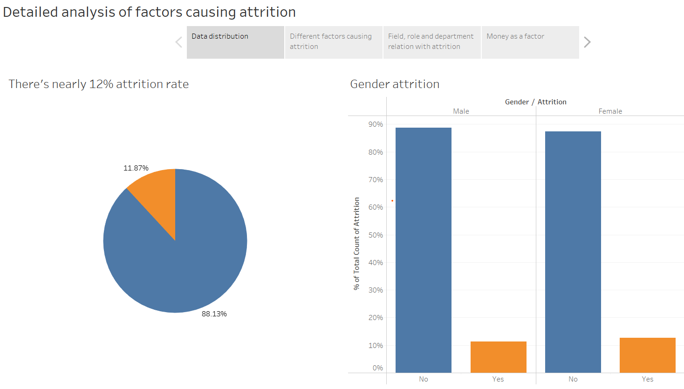
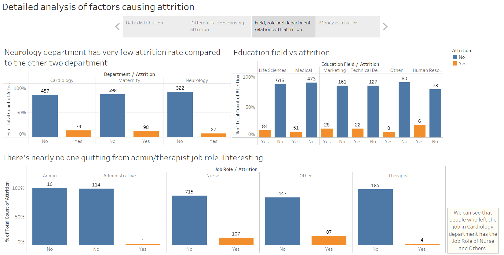
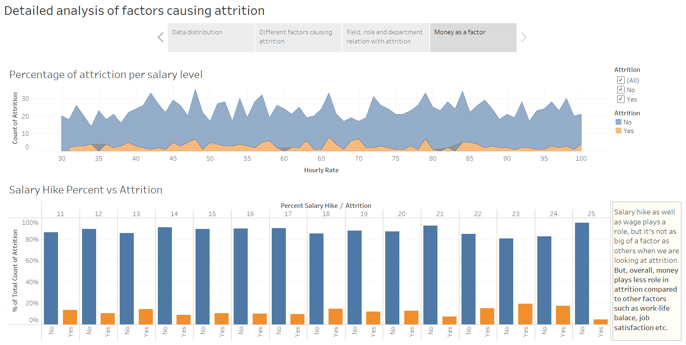

# Positive Pulse

## Inspiration
As we know that healthcare providers burnout is a serious issue that affects many people working in the healthcare industry. It can result from a combination of factors, including long and demanding work hours, high levels of stress and responsibility, exposure to traumatic events, and a lack of control over one's work environment. Tweeting about burnout can provide a sense of community and help healthcare providers feel less isolated in their struggles. So, we are trying to find the tweets which are related to burnout and give them a positive automated reply so they can feel a little sense of relaxation.

## What it does
With Positive Pulse we try to help and keep the healthcare providers motivated and not depressed and burnout. It is a small step on our part to keep the force that keeps us healthy and feel appreciated. Positive Pulse on Twitter replies to tweets which sound depressing or burnout with a positive appreciative tweet in return.

## Insights from visualization

## How we built it
We used Python and Tableau to get data driven insights on burnout in healthcare industry. We used NLP tools, sentiment intensity analyzer and tf-idf vectorizer to classify the tweet as a burnout or non-burnout tweet. Then, we created visuals for the same using wordcloud to find the words occuring most in burnout tweets. 

## Challenges we ran into
Getting a dataset. It was very diffcult to find the right dataset needed for the problem. This took quite a bit of our time.

## What we learned
We learned a lot about burnout in healthcare industry, gaining new insights on the topic. We learnt a ton of new libraries, packages and tools.

## What's next for Positive Pulse?
Creating a twitter bot that finds burnout tweets by healthcare providers and reply them with a positive, energetic and insightful reply according to their tweet.

## Built With
python, tableau, data-visualization, machine-learning, natural-language-processing, wordcloud, sentiment-intensity-analyzer
